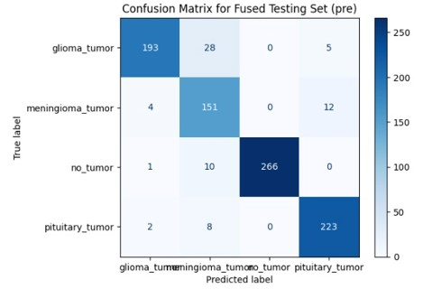

# Brain Tumor Classification with MRI Images Using Fusion Model   

## 🧠 Introduzione  
Il progetto mira a sviluppare un sistema di classificazione automatica dei tumori cerebrali utilizzando immagini di risonanza magnetica (MRI) e modelli di deep learning combinati. Questo sistema mira a supportare i medici nella diagnosi precoce e accurata dei tumori cerebrali, migliorando così i trattamenti e riducendo il rischio di errori umani.

---

## 🚀 Sistema Proposto  
Il sistema è stato sviluppato seguendo i seguenti passaggi:  
1. **Preprocessing**: Identificazione dei duplicati, ridimensionamento a 224x224 pixel, normalizzazione e filtraggio.  
2. **Data Augmentation**: Rotazioni, modifiche di luminosità, contrasto e distorsioni.  
3. **Feature Extraction**: Utilizzo dei modelli pre-addestrati ResNet50 e VGG16 per estrarre le caratteristiche chiave.  
4. **Modello Fuso**: Combinazione delle caratteristiche estratte per migliorare le prestazioni.

---

## 📊 Dataset  
- **Sartaj Dataset**: 3.265 immagini suddivise in 4 classi (glioma, meningioma, pituitary, no_tumor).
  **Distribuzione del Dataset:**
  - **Training**: 80% delle immagini.
  - **Testing**: 20% delle immagini.
- **Figshare + Br35H**: Unione dei due dataset per ottenere 903 immagini usate esclusivamente per testare il modello.

---

## 🛠️ Preprocessing  
- **Calcolo dell'Hash**: Identificazione e rimozione dei duplicati.  
- **Ridimensionamento**: Tutte le immagini sono ridimensionate a 224x224 pixel per garantire uniformità.  
- **Normalizzazione**: I valori dei pixel sono normalizzati per migliorare la qualità dei dati in input.  
- **Filtraggio Gaussiano**: Riduce il rumore e mantiene la regione di interesse.
**Immagini prima del pre-processing**:

**Immagini dopo il pre-processing**:

---

## 🔄 Data Augmentation  
- **Rotazioni e Flip**: Rotazioni casuali tra -7° e +7° con flip orizzontale e verticale.  
- **Modifiche di Luminosità e Contrasto**: Alterazioni casuali per aumentare la varietà delle immagini.  
- **Distorsioni Elastiche e Equalizzazione**: Per migliorare la rappresentazione delle immagini.

---

## 🔧 Modello Fuso  
Il modello fuso utilizza le caratteristiche estratte dagli ultimi layer convoluzionali di ResNet50 e VGG16 per costruire un sistema più robusto e preciso.  

---

## 📈 Testing e Risultati  
- Il modello ha ottenuto un'accuratezza complessiva del **92%**.  
- La matrice di confusione mostra prestazioni solide nelle quattro classi:  

## 🏁 Come Eseguire
1)  Clonare la repository

    - git clone https://github.com/username/BrainTumor-MRI-Classifier.git
    - cd BrainTumor-MRI-Classifier

2)  Eseguire il preprocessing

    - Utilizzare  OperazioniPreProcessing.py per eseguire le operazioni di pre processing

3)  Training del modello
   
    - Addestrare il modello utilizzando ModelloTrainingCollettivo.py

4)  Testing del modello
   
    - Visualizzare i risultati del modello attraverso TestingCollettivo.ipynb
